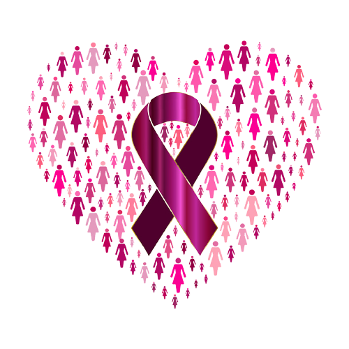
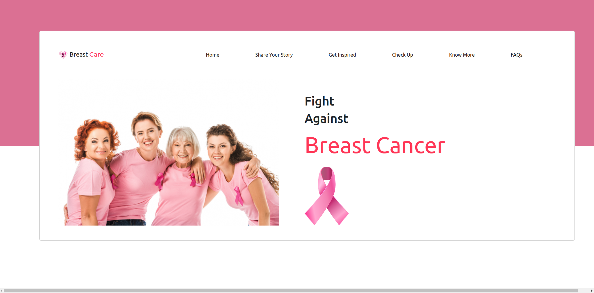
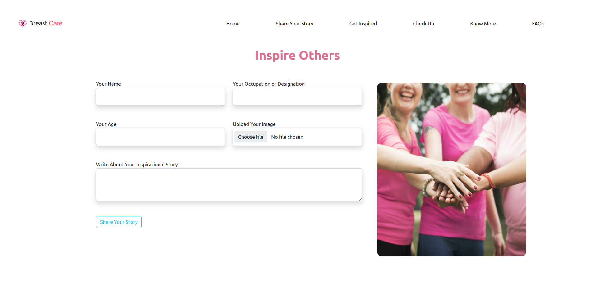
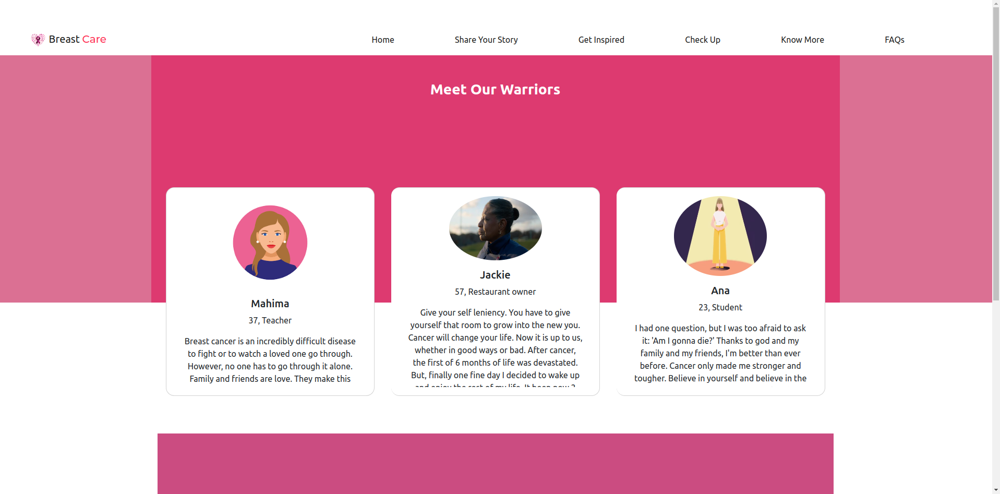
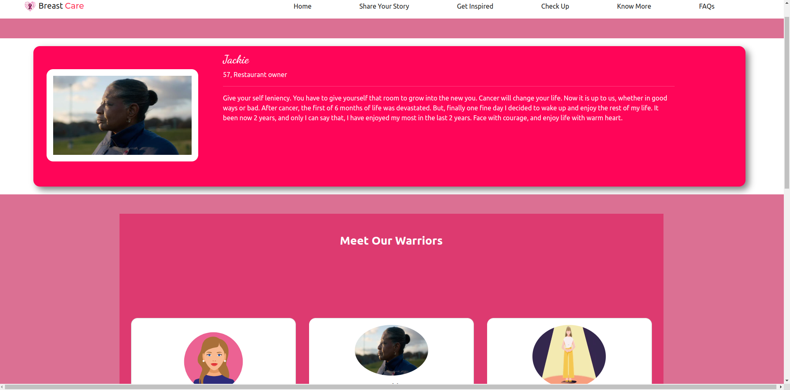
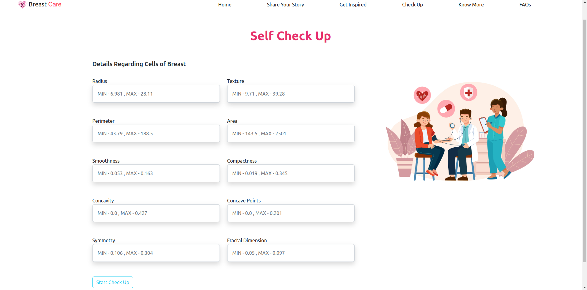
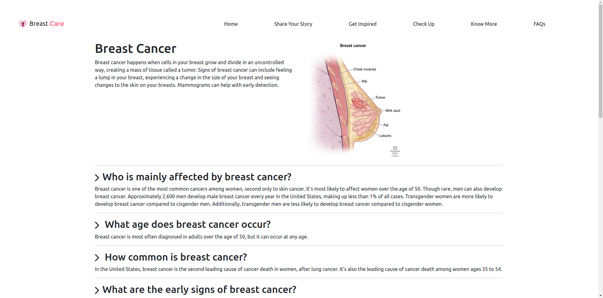
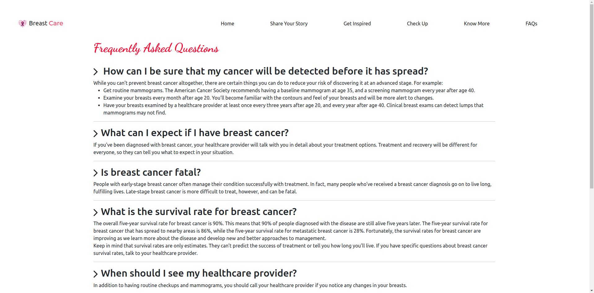

# Breast-Care 
This project was made for **'Hackfest'** a hackathon organized by **['CodeDamn'](https://codedamn.com/)**. We, **"Fate Twisters"**, a team of three undergrads, [Amit Kumar Mahato](https://github.com/weaponxwolf), [Deependu Jha](https://github.com/deependujha), and [Nitesh Kumar](https://github.com/niteshKrr) took part in this hackathon and did our best to complete this project in 36 hours (even less than 2 days).
 
 
Our project is about the **Breast Cancer**. Breast Cancer is at the second position in all deaths due to cancer. It is very much ignored in India. Even if a woman feels pain in her breasts, she feels uncomfortable in consulting a doctor immediately.
 
The project is regarding, others/ people who suffered or went through the horrific cancer motivating other fighters to not to give up their fight with cancer. People can share their experience, read about experiences of others, and also read about what is breast cancer, how it affects the body, how deadly it is and other FAQs. A logisitics regression model has also been used to predict whether the details given for a cell may be potentially affected by breast cancer or not. Though, we strictly emphasize not to take it seriously, and must consult doctor in any case. 
 
**Your health is what matters most for us, not our model or project.**

 ## Tech-stacks used
We have used **Express.js** as backend framework, **MongoDB atlas** as database, and **HBS** as view engine and renderer.

 ## Project
 - **'Home page'** is a simple static page which greets users with a positive mindset to fight against Breast-Cancer, and not to give up.

 
 - **'Share your Story'** page is about fighters sharing their own story, and motivating others how they defeated the evil and got back to their normal life after slaying the life-threatning monster. Uploading image is optional, but we highly encourage to do so. People relate with others less with their names, and more with their face.

 - **'Get Inspired'** is where you will meet our fighters, our brave ladies who dared to fight against cancer and are also willing to share their story, so others don't give up and fight with it with courage. When you click on a person, you can see detailed view of her thoughts.

 - **'Check Up'** is the destination to interact with our machine learing classification model. User fills in the required data, and then logistics regression predicts whether the data belongs to a person with benign or malignant tumor. 

 - **'Know More'** is the perfect place to learn more about breast cancer.

- **'FAQs'** is regarding the general questions one tends to have in their mind.

## Breast-Cancer prediction model
  
Dataset used for modeling is `Breast cancer wisconsin (diagnostic) dataset`.
 - Creator:  Dr. William H. Wolberg, W. Nick Street, Olvi L. Mangasarian
 - Donor: Nick Street
 - Date: November, 1995
#### SK-learn
This dataset is present in Sci-kit Learn module and the logistic regression used uses 'binary cross entropy(log loss)' as loss function. The model predicts 0 or 1.
 * 0 stands for Malignant
 * 1 stands for Benign
 * Malignant is generally considered to be dangerous.
 
We were unable in writing logistics regression in javascript, and as Django was not allowed. So, we figured out another route; node file calls python file, and python file returns the prediction to node file and thus shows output as per required.

## How to setup the project?
To setup the project:
- simply clone the repo.
- move inside the breast-care directory.
- make sure you have python3 installed and sklearn. (pip install sklearn)
- run `npm i` to get node_modules.
- run `node server.js` to start the project
  
#### Thanks.

